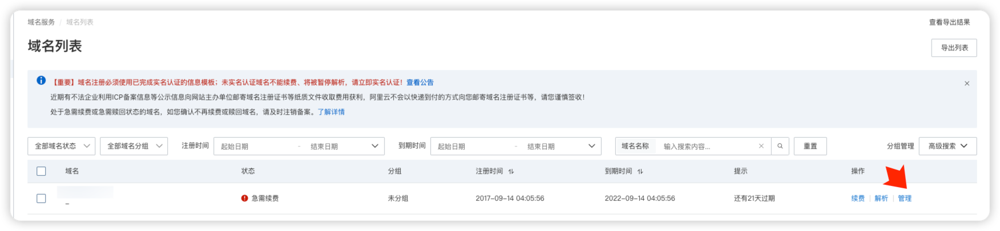
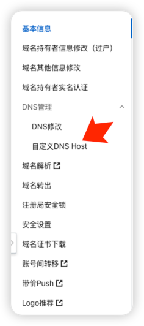
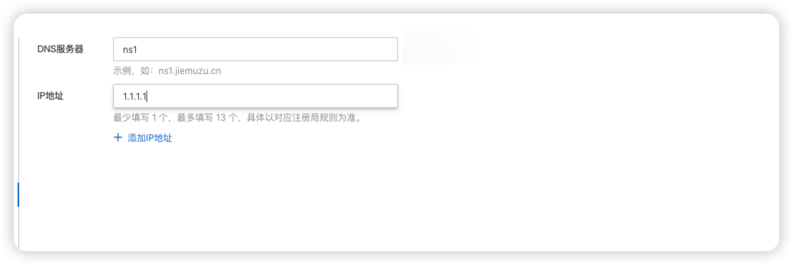
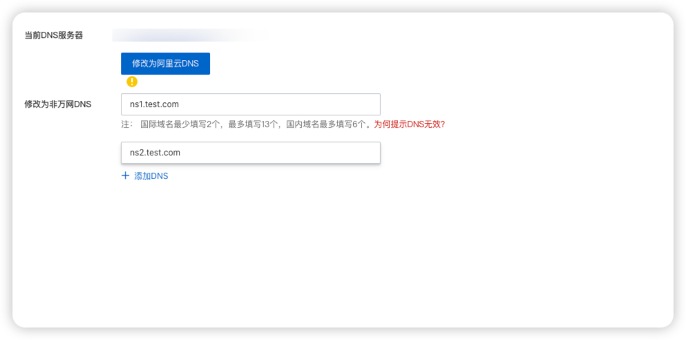
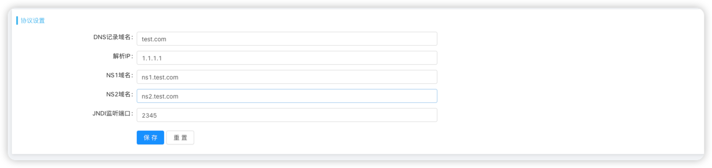
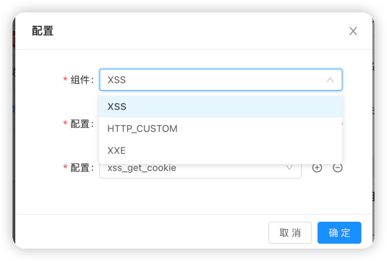
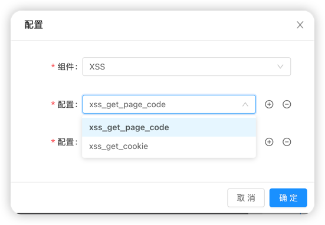
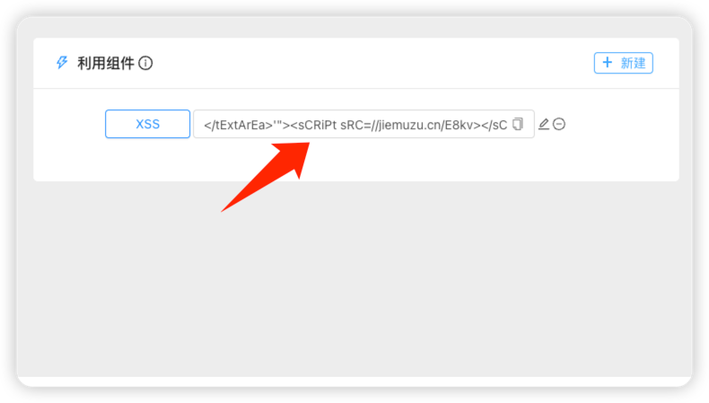
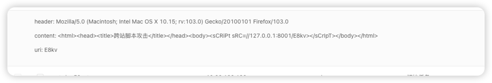
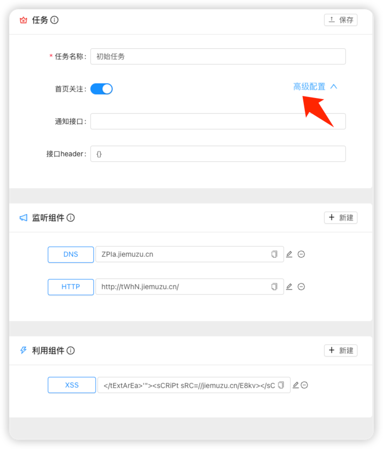

# Antenna

## 免责声明

1. 本工具仅面向 合法授权 的企业安全建设行为与个人学习行为，如您需要测试本工具的可用性，请自行搭建靶机环境。
2. 如您在使用本工具的过程中存在任何非法行为，您需自行承担相应后果，我们将不承担任何法律及连带责任。
   在安装并使用本工具前，请您 务必审慎阅读、充分理解各条款内容限制、免责条款或者其他涉及您重大权益的条款可能会以
   加粗、加下划线等形式提示您重点注意。
   除非您已充分阅读、完全理解并接受本协议所有条款，否则，请您不要安装并使用本工具。您的使用行为或者您以其他任何明示或者默示方式表示接受本协议的，即视为您已阅读并同意本协议的约束。

## Antenna简介

Antenna是58同城安全团队打造的一款辅助安全从业人员辅助验证网络中多种漏洞是否存在以及可利用性的工具。其基于带外应用安全测试(
OAST)通过任务的形式，将不同漏洞场景检测能力通过插件的形式进行集合，通过与目标进行out-bind的数据通信方式进行辅助检测。

## Antenna的目标

我们绝不仅仅只是将Antenna做成一款只能监听DNS、HTTP等协议来简单判断无回显类型漏洞的工具，我们的目标是尝试在良好使用体验的基础上支持高度灵活的自定义组件能力，满足用户通过Antenna探索并实现各种应用安全漏洞场景的辅助检测。尽可能得实现通过Antenna这款产品降低各种安全漏洞场景的检测成本。

## 1. 部署教程

部署前所需

一台公网服务器

一个申请好的域名

### 1.1 源码部署

源码部署服务器系统推荐使用centos，如需部署其他服务器系统需修改项目中install.sh 中部分安装命令

下载源码

```
git clone https://github.com/WUBA/Antenna.git
```

进入项目运行install 脚本

```
cd ./Antenna/bin 
chmod +x ./*
./install.sh
```

脚本运行按照提示填写连接数据库配置与域名信息

填写示例

```angular2html
mysql ip: 127.0.0.1
mysql port: 3306
mysql username: root
mysql password: 123456
plateform_domain: test.com
```

系统会自动创建初始管理员账户antenna@58.com 密码：antenna@58.com
访问之前输入域名系统的8000端口，可访问系统后台并访问


### 1.2 Docker部署

## 2. 使用教程

### 2.1 Antenna初始配置教程

#### 2.1.1 平台设置

管理员账户可进入系统设置-平台管理页面对平台进行配置
平台配置说明

| 配置名称     | 说明                             |
|----------|--------------------------------|
| 开放注册     | 开启后平台允许用户注册使用，该功能需完成邮箱相关配置     |
| 仅允许邀请注册  | 开启后平台只允许拥有邀请码用户注册使用，该功能需完成邮箱相关配置 |
| 开启邮件通知   | 开启后平台接收到消息后都会邮件通知用户，该功能需完成邮箱相关配置 |
| SMTP 服务器 | 邮箱服务器                          |
| 端口       | 邮箱服务器端口，QQ邮箱为465               |
| 账号       | 发送邮件的邮箱账号                      |
| 密码/授权码   | 邮件账号授权码                        |

##### 2.1.1.1 邮箱授权码设置及QQ邮箱授权码申请教程

`https://service.mail.qq.com/cgi-bin/help?subtype=1&id=28&no=1001256`

#### 2.1.2 协议设置

协议配置说明

| 配置名称      | 说明                          |
|-----------|-----------------------------|
| DNS记录域名   | DNS请求域名                     |
| 解析ip      | 建议使用系统服务器公网域名，也可以设置为0.0.0.0 |
| NS1\NS2域名 | DNS解析服务器域名                  |
| 复用监听端口    | 系统复用RMI\LDAP\MYSQL\FTP请求监听端口 |

##### 2.1.2.1 域名配置及阿里云dns服务修改教程

打开阿里云，首先购买域名(购买流程不过多叙述） 购买域名后进入阿里云控制台-域名-域名列表

这里已购买test.com，antenna系统所在服务器公网地址为1.1.1.1为例

点击操作栏中的管理

进入管理界面后点击左侧导航栏DNS管理-自定义DNS HOST



点击创建DNS服务器，然后创建ns1.test.com和ns2.test.com，其ip地址设置为antenna系统所在服务器公网地址

创建后点击同步再进入左侧导航栏DNS管理-DNS修改，点击修改DNS服务器按钮，将test.com的dns服务器修改为刚才设置的ns1.test.com与ns2.test.com

点击同步后回到Antenna系统保存协议相关设置

注意！！！服务器防火墙需开启上述配置端口的进出规则，DNS默认使用53端口也需对外开放！！！

### 2.2 Antenna产品基础使用教程

#### 2.2.1 消息监听与漏洞利用组件
Antenna 初始开放HTTP、DNS、RMI、LDAP 四个监听组件以及XSS、XXE、HTTP_CUSTOM(SSRF/JSONP)等多个漏洞场景利用组件，
其组件最终以链接等方式进行生成。平台通过任务的形式对拥有各种能力的链接进行区分,新用户默认创建初始任务与支持的所有监听组件实例


演示平台：x.x.x.x

漏洞靶场：x.x.x.x
##### 2.2.1.1 新建与使用组件实例(链接)
以创建XSS漏洞场景利用链接为例，首先点击初始任务查看任务详情，然后点击新建开始选择漏洞场景类型

选择XSS组件，平台初始支持get_cookie(获取cookie)与get_page_sources(获取源码)两种利用方式，可进行多选并点击确定



点击确定后便会生成支持获取cookie与源码xss漏洞的利用payload


打开官方靶场尝试利用xss生成链接

查看消息列表，已经获取到漏洞页面的请求cookie与源码


### 2.2.2 Antennna 消息处理教程

系统接收到来自组件的请求后，用户不能及时获取相关信息结果，Antenan系统提供三种方式获取请求消息

#### 2.2.2.1 Open API

Antenna 提供对外API供用户主动查询平台接收到的消息
点击系统左侧导航栏-OpenAPI 查看个人用户APIKEY
查询消息接口
`http://{platform_domain}/api/v1/messages/manage/api/?apilkey={apikey}&uri=&task__name=&message_type=&page=&page_size=`

支持参数列表

| 参数名          | 含义                             |
|--------------|--------------------------------|
| task__name   | 消息所属任务名                        |
| message_type | 消息类型 1是http,2是dns,3是ldap,4是rmi |
| uri          | 消息请求路径                         |
| page         | 消息页数                           |
| page_size    | 消息每页数量                         |

#### 2.2.2.2 自定义消息接口使用

平台除了设置消息邮件通知以外，支持接收到消息后，向自定义接口发送消息数据，方便自动化工具回调接口处理请求消息
点击任务查看任务详情，打开任务高级配置


填写接受消息的接口 例如
`http://test.com/get_message`
如接口需要Authorization等认证方式可写在接口header中，例如
`{"Authorization": "admin"}`
平台接收到该任务的消息后会向test.com/get_message发送接收到的请求消息数据

## 3. Antenna组件开发教程

### 3.1 自定义利用组件编写

[如何编写Antenna组件](./docs/develop_template.md)

## 4. 联系我们

如果对Antenna有任何建设性意见或 BUG 反馈，欢迎大家提 issue,进交流群 作者也会线下约饭进行奖励🐶

如有问题想与技术同学沟通，请联系并添加微信号：bios_000

Antenna用户交流群：
